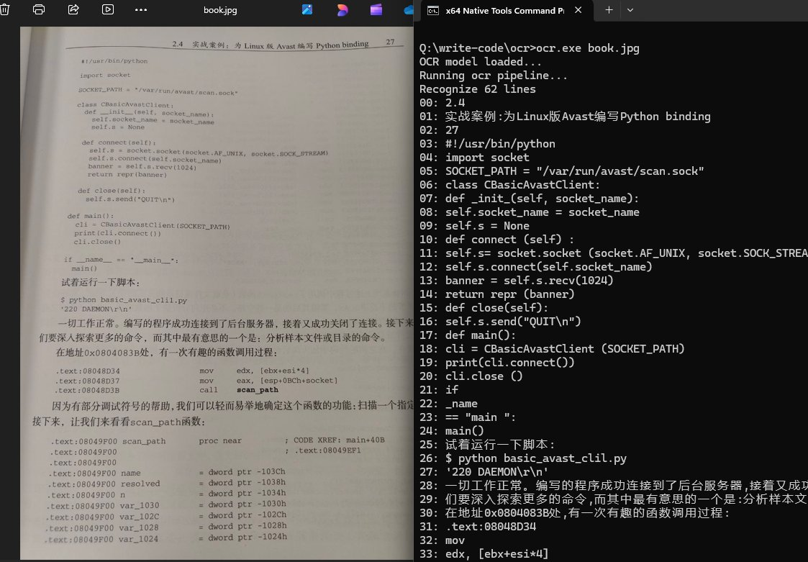

# Windows11 SnippingTool OCR

blog post: https://b1tg.github.io/post/win11-oneocr/

Tested on Win11 23H2 + SnippingTool 11.2409.25.0

Build this code needs opencv installed.

How to use:

The code depends on the DLLs and offline AI model, the easiest 
way is copy those files from SnippingTool folder, puts them in
the same folder of ocr.exe

includes: 

- `oneocr.dll`
- `oneocr.onemodel`
- `onnxruntime.dll`

On my computer the SnippingTool folder located at `C:\Program Files\WindowsApps\Microsoft.ScreenSketch_11.2409.25.0_x64__8wekyb3d8bbwe\SnippingTool` (You may need to change the access rights in the Security Tab of the properties (add your user as the owner))

Install [OpenCV (4.6.0)](https://github.com/opencv/opencv/releases/tag/4.6.0)

also add the `opencv_world460.dll`

## Build

Install VS with MSVC / C++ packages
Use `x64 Native Tools Command Prompt for VS 20XX` to build the app for x64 systems
